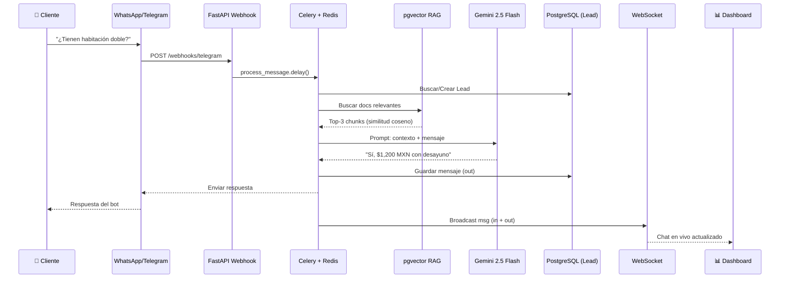
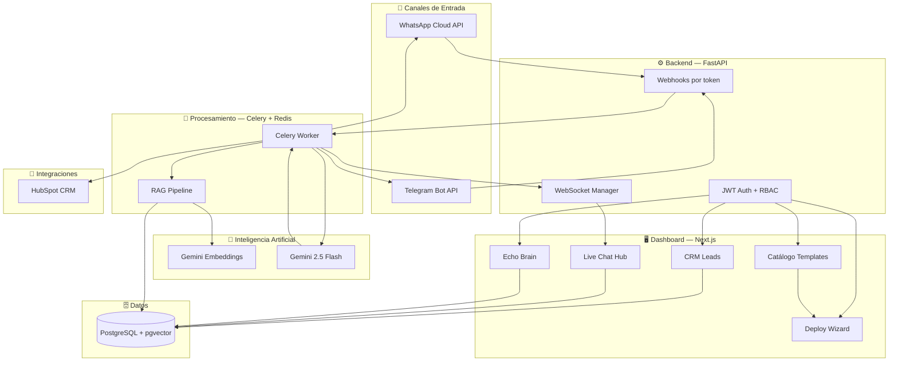
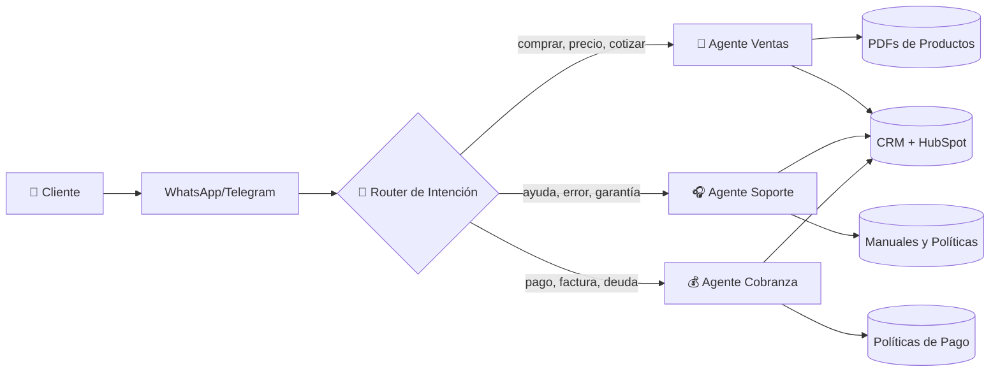

# Echo — Investor Pitch

> **Un asistente de IA que vive en tu WhatsApp y Telegram, conoce tus documentos internos, y organiza tus clientes automáticamente. Corre en tu propio servidor, tus datos no salen de tu control.**

---

## 1. ¿Qué es Echo?

Echo es una plataforma **self-hosted** de automatización conversacional con IA para PYMES. Conecta WhatsApp y Telegram a un agente de inteligencia artificial que:

- **Responde automáticamente** usando el conocimiento real del negocio (PDFs, políticas, catálogos)
- **Organiza leads** en un CRM integrado, con calificación automática por sentimiento
- **Permite intervención humana** en tiempo real desde un dashboard unificado
- **Sincroniza bidireccionalmente** con HubSpot (CRM externo)
- **Corre en el servidor del cliente** — datos 100% privados, sin suscripciones SaaS obligatorias
- **Catálogo de templates** para desplegar operadores de IA en 2 clics (ventas, soporte, cobranza, onboarding)
- **Deploy Wizard** inteligente que configura el bot automáticamente según el vertical del negocio

---

## 2. ¿Para quién es?

| Vertical | Problema que resuelve | Caso real |
|---|---|---|
| **Inmobiliarias** | Responder consultas de propiedades 24/7 | Bot que responde precio, ubicación, metros desde PDF del catálogo y deja el lead calificado en CRM |
| **Clínicas/Consultorios** | Agendar citas, FAQs, derivar urgencias | Paciente escribe por WhatsApp, el bot confirma disponibilidad y deriva casos urgentes al doctor |
| **E-commerce chico** | Soporte post-venta automatizado | "¿Dónde está mi pedido?" → bot consulta orden y responde sin intervención humana |
| **Hoteles/Agencias** | Información de servicios, tours, reservas | Catálogo PDF → bot responde disponibilidad, precios, políticas de cancelación |
| **Bufetes/Consultorías** | Responder con base en documentos legales/técnicos | Cliente pregunta sobre un servicio, el bot responde usando los PDFs del despacho |
| **Colegios/Academias** | Inscripciones, calendarios, captación | Padres preguntan requisitos por WhatsApp, el bot responde y captura sus datos |

---

## 3. ¿Cómo funciona? (Demo en 60 segundos)

**El cliente nunca sabe si habla con IA o con un humano.** Y el negocio mantiene el control total.

---

## 4. Stack Técnico

| Capa | Tecnología | ¿Por qué? |
|---|---|---|
| **Backend** | FastAPI + Python 3.11 | Async nativo, alta concurrencia, tipado fuerte |
| **Base de datos** | PostgreSQL 16 + pgvector | Búsqueda vectorial sobre documentos del negocio |
| **Cola de tareas** | Celery + Redis | Procesamiento asíncrono con reintentos ante fallos |
| **IA** | Gemini 2.5 Flash + gemini-embedding-001 | RAG pipeline: embeddings 3072d + generación contextual |
| **Mensajería** | Telegram Bot API, Meta WhatsApp Cloud API v21.0 | Canales directos donde ya están los clientes |
| **Frontend** | Next.js 16 + Tailwind CSS v4 + @base-ui/react | App Router, server components, WebSocket en tiempo real |
| **Tiempo real** | FastAPI WebSockets | Mensajes entrantes/salientes al dashboard sin recargar |
| **CRM Externo** | HubSpot API v3 | Sincronización bidireccional de contactos |
| **Pagos** | Stripe (planeado) | Monetización multi-plan (free, pro, enterprise) |
| **Tests** | pytest + Playwright E2E | 8 tests end-to-end automatizados |
| **Infraestructura** | Docker Compose, ngrok | Deploy local en 1 comando, túnel público para webhooks |

---

## 5. Filosofía: Harness Engineering

> *"No reinventamos la rueda. Ensamblamos las mejores piezas y las hacemos funcionar juntas."*

Echo no compite construyendo modelos de IA propios ni reinventando infraestructura. Competimos en **integración y experiencia**:

| Principio | Aplicación en Echo |
|---|---|
| **Stand on giants** | Gemini para IA, pgvector para búsqueda, Celery para tareas — tecnología probada en producción |
| **Glue, not rebuild** | FastAPI actúa como orquestador entre WhatsApp, Telegram, IA, DB y frontend |
| **Data sovereignty** | Self-hosted: el cliente es dueño de sus datos, sus conversaciones, sus documentos |
| **Progressive complexity** | Funciona en 1 comando (`.\dev.ps1`). La complejidad (multi-tenant, multi-canal, RAG) está abstraída |
| **Human-in-the-loop** | La IA no reemplaza al humano — lo asiste. Un clic en "Pause AI" y el humano toma el control |
| **Template-driven deployment** | 5 templates pre-entrenados (Ventas, Soporte, Onboarding, Cobranza, Assistant). Elige uno y despliega en 2 clics |

---

## 6. Modelo de Negocio

| Plan | Precio | Incluye |
|---|---|---|
| **Free** | $0/mes | 50 mensajes/mes, 1 documento, 3 leads |
| **Pro** | $29/mes | Mensajes ilimitados, 50 documentos, leads ilimitados, HubSpot sync |
| **Enterprise** | $99/mes | Multi-workspace, white-label, soporte prioritario, integraciones personalizadas |

**Ventaja competitiva en pricing:** Al ser self-hosted, no hay costo de infraestructura para Echo. El cliente paga su propio VPS ($6/mes) + su API key de Gemini (pay-per-use).

---

## 7. Competencia y Posicionamiento

| | **Echo** | **Sintra.ai** | **ManyChat** | **Chatbase** |
|---|---|---|---|---|
| Self-hosted | ✅ | ❌ | ❌ | ❌ |
| WhatsApp + Telegram | ✅ | ❌ | ✅ | ❌ |
| CRM integrado | ✅ | ❌ | ❌ | ❌ |
| RAG con docs propios | ✅ | Limitado | ❌ | ✅ |
| Templates verticales | ✅ 5 verticales | ❌ | ❌ | ❌ |
| Multi-tenant | ✅ | ✅ | ❌ | ❌ |
| White-label | ✅ | ❌ | ❌ | ❌ |
| Precio entry | $0 | $59/mes | $15/mes | $19/mes |

**Diferenciador clave:** Echo es el único que ofrece self-hosted + IA con RAG + CRM + templates por vertical + multi-canal en un solo producto. El cliente controla sus datos y paga solo por lo que usa.

---

## 8. Roadmap

| Fase | Estado | Hito |
|---|---|---|
| **Fase 1** | ✅ Completado | Backend FastAPI + PostgreSQL + Alembic migrations |
| **Fase 2** | ✅ Completado | Telegram + WhatsApp webhooks con routing dinámico por token |
| **Fase 3** | ✅ Completado | Dashboard Next.js: Live Chat, CRM Leads, Brain, Auth JWT |
| **Fase 4** | ✅ Completado | RAG con pgvector + Gemini, Brain upload de documentos PDF/TXT |
| **Fase 5** | ✅ Completado | Catálogo de templates + Deploy Wizard dinámico |
| **Fase 6** | ✅ Completado | HubSpot CRM bidireccional, sincronización de contactos |
| **Fase 7** | ✅ Completado | Tests automatizados (pytest + 8 tests Playwright E2E) |
| **Fase 8** | ✅ Completado | Celery worker + Redis para procesamiento asíncrono de mensajes |
| **Fase 9** | 🔜 Próximo | Stripe suscripciones, facturación, webhooks de pago |
| **Fase 10** | 📋 Planeado | One-click deploy, white-label total, analytics dashboard |
| **Fase 11** | 📋 Planeado | Voice calls, Instagram DM, acciones reales (agendar, pagar) |
| **Fase 12** | 📋 Planeado | Multi-agente (ventas/soporte/cobranza), no-code flow builder |

---

## 9. Cómo llevar Echo al siguiente nivel

| Mejora | Impacto | Descripción |
|---|---|---|
| **One-click deploy** | 🚀 Adopción | `curl \| bash` y en 60 segundos Echo corre en un VPS de $6/mes con SSL y dominio. Sin Docker, sin manuales. |
| **Templates por industria** | 🎯 Conversión | Inmobiliario, salud, e-commerce, educación — el cliente elige su vertical y Echo precarga PDFs, respuestas y flujos. Onboarding de 15 min → 5 min. |
| **Multi-agente** | 🧠 Diferenciación | Agentes IA separados por área (ventas, soporte, cobranza) con personalidad y conocimiento distintos. Enrutados por intención del mensaje. |
| **White-label total** | 🏷️ Empresas | Logo, colores, nombre del bot, dominio propio del cliente. Echo invisible. Ideal para agencias que revenden a sus clientes. |
| **Voice + más canales** | 📞 Alcance | Llamadas telefónicas (TTS/STV), Instagram DM, Facebook Messenger, email. Donde está el cliente, ahí está Echo. |
| **Acciones reales** | ⚡ Valor | El bot ejecuta: crea cotizaciones, manda link de pago, agenda en Google Calendar, consulta stock del ERP. |
| **Analytics dashboard** | 📊 Retención | Qué preguntan, tasa de resolución bot vs humano, en qué etapa se caen los leads, ROI por canal. Datos que el negocio necesita. |
| **Multi-idioma nativo** | 🌍 Mercado | Detección automática de idioma, respuesta en el mismo idioma. Expande el TAM a LATAM, Europa, Asia. |

**Arquitectura Multi-Agente (Fase 12):**

---

## 10. ¿Qué hace a Echo defendible?

1. **Efecto compounding del conocimiento:** Cada documento que el cliente sube hace al bot más inteligente para SU negocio — migrar a otra plataforma significa re-entrenar desde cero.
2. **Integración vertical:** El cliente no necesita 4 herramientas (bot + CRM + knowledge base + dashboard). Echo es las 4 en una.
3. **Costo de cambio bajo para adoptar, alto para abandonar:** Entrar es gratis. Salir implica perder todo el conocimiento acumulado, los leads organizados y la integración con HubSpot.
4. **Datos como foso:** Mientras más conversaciones procesa Echo, mejor entendemos los patrones de cada industria para ofrecer templates pre-entrenados.
5. **Deploy Wizard patentable:** El proceso de configurar un bot de IA en 2 clics es una barrera de entrada contra competidores que requieren configuración manual compleja.

---

## 11. Métricas Clave (Proyectadas)

| Métrica | Año 1 | Año 2 |
|---|---|---|
| Clientes activos | 50 | 300 |
| MRR | $2,450 | $14,700 |
| Churn mensual | <5% | <3% |
| CAC (costo adquisición) | $40 | $25 |
| LTV | $588 | $980 |
| Tiempo de onboarding | 15 min | 5 min (con templates) |

---

## 12. Equipo y Filosofía

Echo se construye bajo **Harness Engineering**: no competimos en investigación de IA fundamental. Nuestra ventaja es saber integrar lo mejor que ya existe (Gemini, pgvector, FastAPI, Celery) en un producto que una PYME puede instalar, entender y usar en una tarde.

**Principios del equipo:**
- **Ship fast, iterate faster** — funcional sobre perfecto
- **El código es un liability, no un asset** — menos líneas, menos bugs
- **Self-hosted no significa complicado** — `.\dev.ps1` y listo
- **El usuario es dueño de sus datos** — sin excepciones
- **Templates, not complexity** — el Deploy Wizard abstrae la configuración técnica

---

## 13. La Oportunidad

Hay **330 millones de PYMES** en el mundo. La mayoría usa WhatsApp para comunicarse con clientes. Casi ninguna tiene un bot con IA que conozca su negocio. Las que lo intentan usan SaaS que se llevan sus datos y cobran por mensaje.

**Echo les da el control. Por el precio de un VPS.**

---

*Echo v0.2.0 — Junio 2026*
